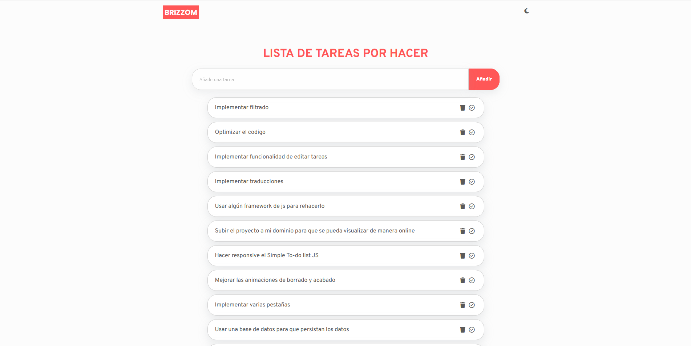
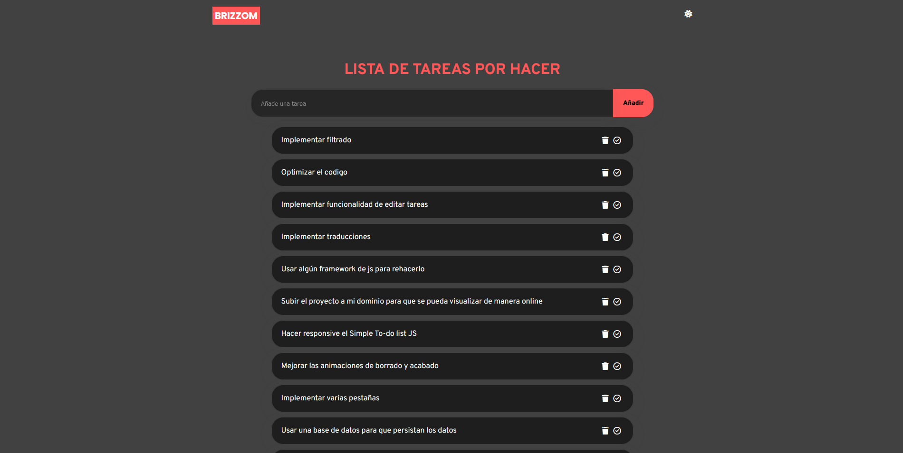

# Simple To-do List JS :ballot_box_with_check:

Proyecto sencillo de un To-do List que permite añadir, elimnar y finzalizar tareas. Además de cambiar entre tema oscuro y claro.

## Objetivo
- Profundizar las bases de Vanilla JS y el LocalStorage.
- Prácticar el diseño de interfaces.
- Repasar y descubrir nuevas implementaciones en maquetación con CSS.

## Version
0.0.1

## Tecnologías:

 

 

## Mejoras futuras
- Hacerlo responsive.
- Implementar más funcionalidades: 
  - Editar tareas.
  - Traducciones.
  - Etiquetas.
  - Filtrado. 
  - Varias pestañas (para una mejor organización).
  - Base de datos para que persistan los datos.
  - Subirlo a un dominio propio para que se pueda probar online.
  - etc.
- Mejora de las animaciones de borrado y hecho.
- Usar algún framework de JS para rehacerlo. 

## Preview
### Modo Claro :sun_with_face:

### Modo Oscuro :new_moon_with_face:

## Tiempo dedicado
1 semana